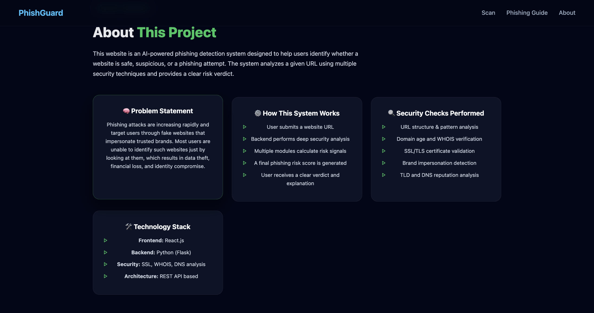
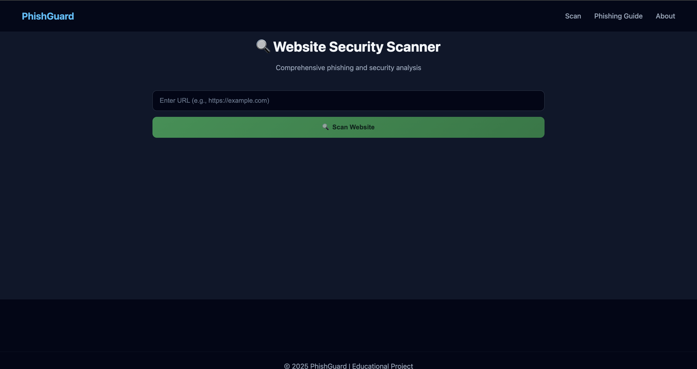
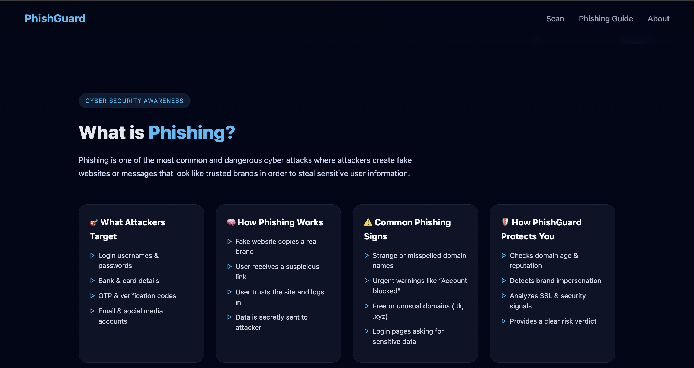

# 🛡️ PhishGuard – AI Powered Phishing Detection System

PhishGuard is an **AI-powered cybersecurity web application** designed to detect **phishing and fake websites**.  
It helps users instantly check whether a website is **Safe, Suspicious, or a Phishing attempt** using multiple security checks.

---

## 🚨 What is Phishing?

Phishing is one of the most common cyber attacks where attackers create **fake websites or messages** that look like trusted brands to steal:
- Login usernames & passwords  
- Bank & card details  
- OTP & verification codes  
- Personal information  

PhishGuard helps users **identify such threats before damage happens**.

---

## 🎯 Project Objective

The main goal of this project is to:
- Spread **cybersecurity awareness**
- Protect users from phishing attacks
- Provide a **simple and user-friendly phishing detection tool**
- Help students understand real-world cyber threats

---

## 🔍 Key Features

✔ URL structure & pattern analysis  
✔ Domain age & WHOIS verification  
✔ SSL/TLS certificate validation  
✔ Brand impersonation detection  
✔ Suspicious TLD & DNS analysis  
✔ Risk score generation  
✔ Clean & modern UI  
✔ No login required  

---

## 🧠 How PhishGuard Works

1. User enters a website URL  
2. Backend performs deep security analysis  
3. Multiple modules calculate risk signals  
4. Final phishing risk score is generated  
5. User gets a clear verdict with explanation  

---

## 🏗️ Technology Stack

- **Frontend:** React.js  
- **Backend:** Python (Flask)  
- **Security:** SSL, WHOIS, DNS analysis  
- **Architecture:** REST API based  

---

## 📸 Application Screenshots

### 🏠 Home – Phishing Detection

---

### 📘 Phishing Guide & Awareness

---

### 📊 About Project Overview

---

### ⚙️ Technology Stack & Objective

---

## 📁 Project Structure

